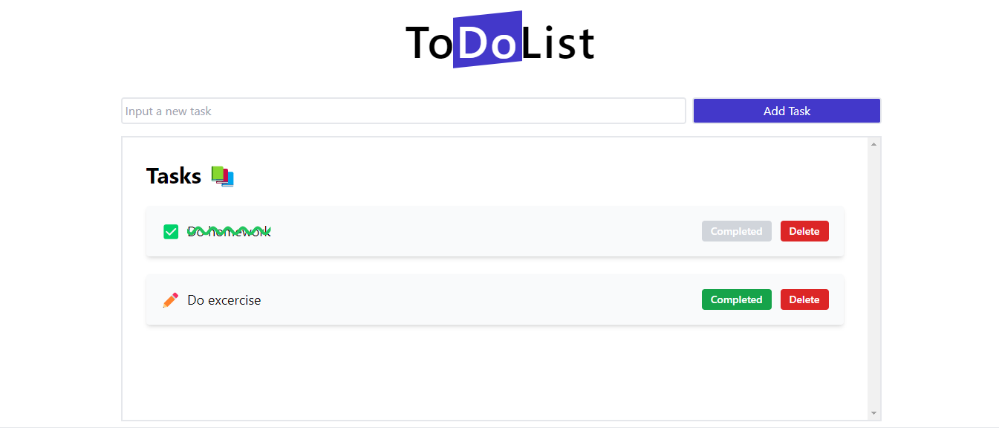

# To Do List React + Taildwind + Vite + LocalStorage

## Table of contents
  - [How to run](#Run)
  - [Screenshot](#screenshot)
  - [Links](#links)
  - [Built with](#built-with)
  - [Useful resources](#useful-resources)
- [Author](#author)

### How to run
npm install
npm run dev

### Screenshot

### Links

- Live Site URL: [To do List]()

### Built with

- Semantic HTML5 markup
- Responsive Web Design
- JavaScript
- Tailwind CSS
- React
- NPM

### Useful resources

- [Tailwind CSS](https://tailwindcss.com/docs/installation) - This helped me for documentation in TailwindCSS.

## Author

- Website - [Donovan Romero Escogido](https://github.com/nsvonod12)
